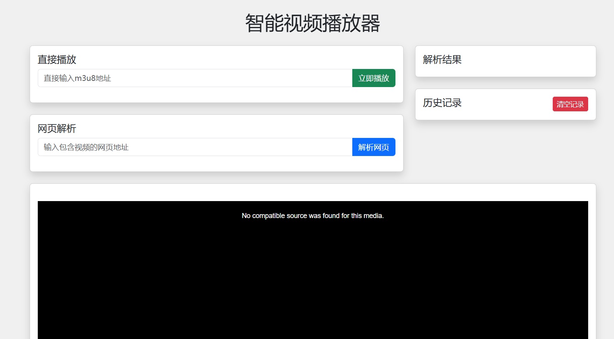

# 在线视频播放器 

基于 Flask 的智能视频播放平台，支持 m3u8 视频解析、网页视频提取、历史记录管理，具备响应式移动端界面。



## 核心功能
✅ **多模式播放**  
- 直接输入 m3u8 地址播放
- 解析网页自动提取视频源
- 支持历史记录回放

✅ **智能管理**  
- 自动保存播放历史
- 支持记录删除/批量清理
- URL 去重存储

✅ **跨平台适配**  
- 响应式布局（PC/移动端）
- 触控优化界面
- 自适应视频分辨率

## 技术栈
- 后端：Python 3.8+ / Flask
- 前端：Bootstrap 5 / Video.js
- 数据库：SQLite
- 依赖管理：requirements.txt

## 快速开始
```bash
# 克隆仓库
git clone https://github.com/yzmninglang/Player_Online_Re.git
cd Player_Online_Re

# 安装依赖
pip install -r requirements.txt

# 启动服务（开发模式）
python app.py
```

访问 `http://localhost:5000` 开始使用

## 部署指南
```bash
# 生产环境部署建议
pip install gunicorn

# 启动服务
gunicorn -w 4 -b 0.0.0.0:5000 app:app --daemon

# 配置 Nginx 反向代理（示例配置）
server {
    listen 80;
    server_name yourdomain.com;

location / {
        proxy_pass http://localhost:5000;
        proxy_set_header Host $host; proxy_set_header X-Real-IP$remote_addr;
    }
}
```

## 功能特性
✅ 1. 直接播放
✅  2. 网页解析
✅  3. 历史记录


## API 文档

| 接口             | 方法   | 说明         |
| ---------------- | ------ | ------------ |
| `/parse`         | POST   | 网页视频解析 |
| `/history`       | GET    | 获取历史记录 |
| `/history`       | POST   | 添加历史记录 |
| `/history/<url>` | DELETE | 删除指定记录 |
| `/history`       | DELETE | 清空所有记录 |

## 贡献指南
1. Fork 本仓库
2. 创建特性分支 (`git checkout -b feature/AmazingFeature`)
3. 提交修改 (`git commit -m 'Add some AmazingFeature'`)
4. 推送分支 (`git push origin feature/AmazingFeature`)
5. 提交 Pull Request

## 许可证
本项目采用 MIT 许可证，详情见 [LICENSE](LICENSE) 文件

## 项目状态

当前版本：v1.0.0（开发中）  
兼容性：  

- Python 3.8+  
- 现代浏览器及移动端设备
